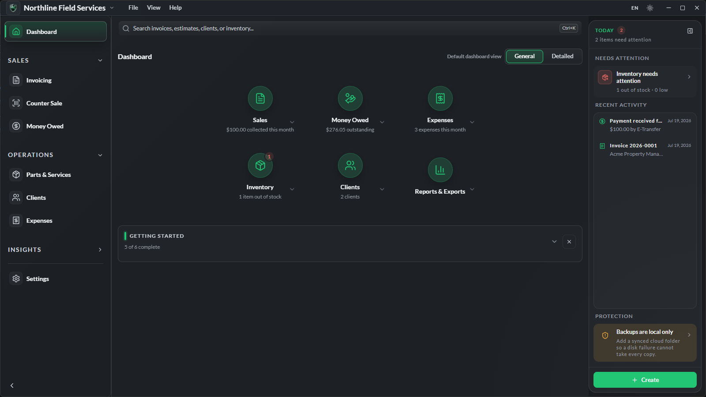
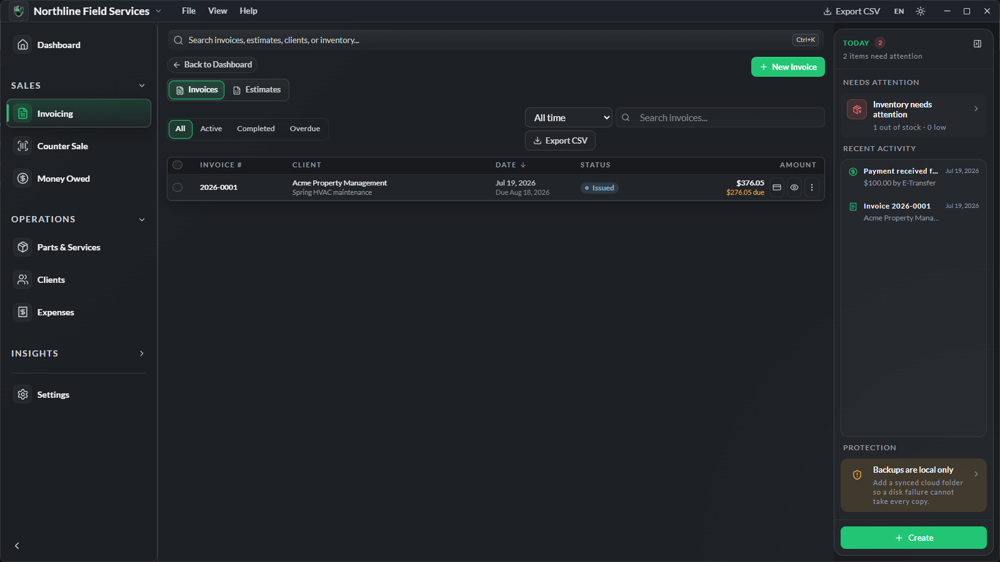
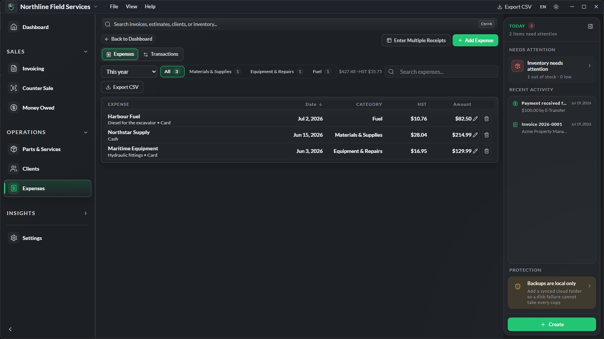
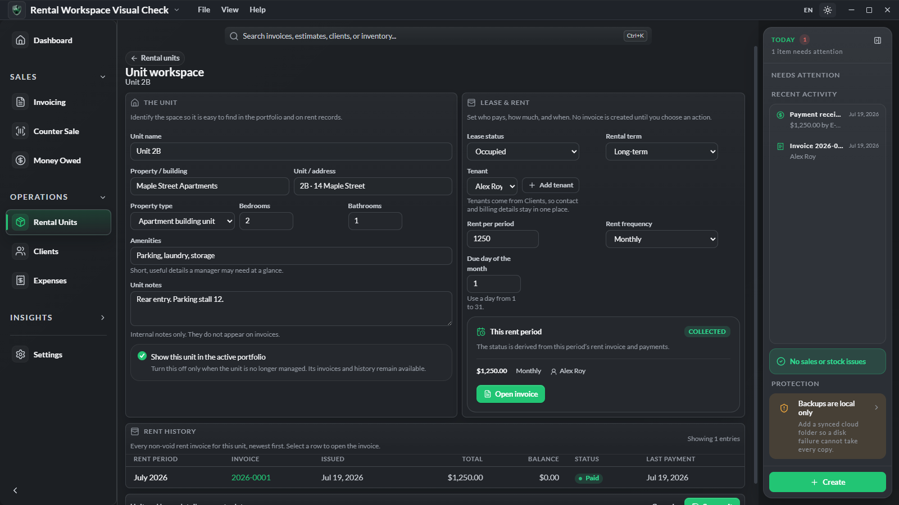

# NoCloud

NoCloud is an offline-first Windows desktop business hub for small businesses.
It brings clients, inventory, invoicing, estimates, receivables, expenses,
rent collection, notes, reporting, and backups into one application. Business
data stays in a local SQLite database on the user's computer.

This public repository contains the downloadable NoCloud installers and update
manifests. The source code is maintained separately in a private repository.

## See NoCloud

These dark-mode screenshots show the real desktop application using fictional
demonstration data. No customer or business records are included.

| Invoicing | Expenses |
| --- | --- |
|  |  |

### Rental unit workspace

NoCloud v1.4.0 adds a focused unit workspace for property details, lease and
tenant setup, current rent status, payment recording, and per-unit rent history.

## Latest release

**Current version: [NoCloud v1.4.1](https://github.com/GLevek89/NoCloud-Releases/releases/tag/v1.4.1)**

- [Open the latest release](https://github.com/GLevek89/NoCloud-Releases/releases/latest)
- [Download NoCloud-Setup-1.4.1.exe](https://github.com/GLevek89/NoCloud-Releases/releases/download/v1.4.1/NoCloud-Setup-1.4.1.exe)
- Windows 10 or Windows 11, 64-bit
- Installer SHA-256: `a9a60964ba169b02a77157e66d0d71b9cd0c9f035277ace367e2926eea844093`

NoCloud v1.4.1 improves display comfort on SDR and HDR screens. It adds five
tested brightness levels to both NoCloud Light and NoCloud Dark, automatically
selects Brighter on SDR or Darker on HDR, and keeps a per-computer manual
override. The dashboard controls and launcher tiles now stay aligned to the
left on wide windows, and the Protection status uses a compact single-row card.

This release does not change the database schema, rename rental custom fields,
or rewrite existing business records. The complete release passed 559 automated
tests, migration recovery and IPC safety checks, a production build, and real
Electron interaction and layout audits.

> **Windows SmartScreen:** The installer is not code-signed yet. Windows may
> display “Windows protected your PC.” Choose **More info → Run anyway** only
> after confirming the installer came from this repository.

## Installation

1. Download `NoCloud-Setup-1.4.1.exe` from the release link above.
2. Run the installer.
3. Launch NoCloud and enter your license key.
4. Complete the setup wizard and choose the business model that matches your
   work.

## What NoCloud includes

- **Invoicing and estimates:** payments, HST, due dates, overdue tracking,
  deposits, holdback/progress billing, counter sales, and estimate conversion.
- **Invoice design:** four PDF layouts, live preview, bundled fonts, custom
  colours, logo placement, paper settings, footers, and saved presets.
- **Inventory:** products, materials, services, stock movements, low-stock
  alerts, kits, spreadsheet import, and optional parts starter catalogs.
- **Excavation and parts sales:** tailored inventory groups, service presets,
  receiving workflows, and parts-focused starter catalogs.
- **Rental locations:** properties and units, tenant assignment, monthly or
  weekly rent schedules, due/late status, and rent-payment recording.
- **Expenses and transactions:** HST extraction, vendor memory, quick entry,
  stock-receipt expense linking, and a combined transaction ledger.
- **Receivables and reports:** aging, revenue, HST, rental income, printable
  summaries, and date-range reporting.
- **Exports:** CSV list exports, client statements, batch invoice PDFs,
  accountant-ready XLSX packages, and full-data exports.
- **Multiple business profiles:** keep separate businesses in one installation
  and switch between them.
- **English and French (Canada):** full bilingual interface.
- **Light and dark appearance:** selectable themes, five-level brightness with
  automatic SDR/HDR adaptation, display density, and a rerunnable guided tour.

## Automatic updates

NoCloud checks this repository for updates at startup and periodically while the
application is running. Update packages download in the background and install
only after the user accepts the restart prompt. Automatic update checks can be
disabled from **Settings → About**.

Each published release should contain:

- `NoCloud-Setup-<version>.exe`
- `NoCloud-Setup-<version>.exe.blockmap`
- `latest.yml`

## Data protection

NoCloud is designed around a local, user-owned database:

- SQLite transactions and write-ahead logging protect normal saves.
- Rolling automatic backups and manual backups are supported.
- Backups are validated before restore.
- Restore takes a safety snapshot first and rolls back if validation fails.
- Database migrations require a pre-update snapshot and restore the previous
  database if migration fails.
- Existing invoices, clients, payments, stock movements, and expenses are not
  stored in this repository.

NoCloud is offline-first. Network access is limited to update checks, license
activation, opt-in multi-device features on the user's own network, and feedback
or crash reports only when the user chooses to send them.

## Release policy

A feature is not available to users until a versioned release with all three
required update assets is published here. Development branches and draft source
pull requests are not release builds.

## License

[Apache-2.0](./LICENSE)
