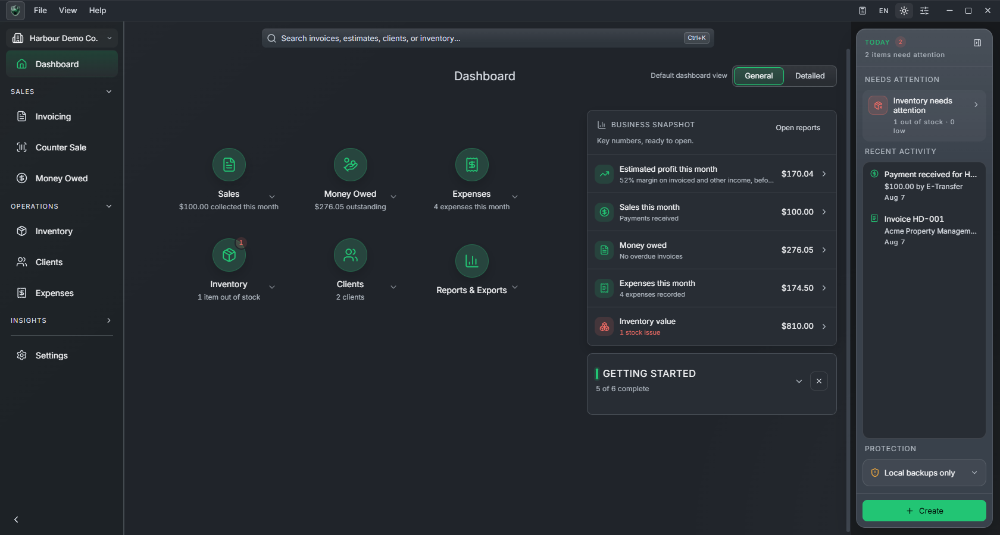
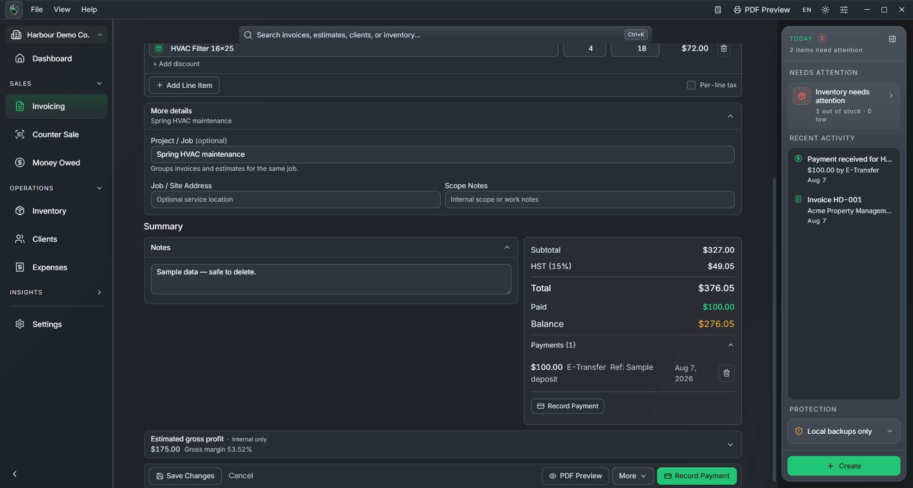
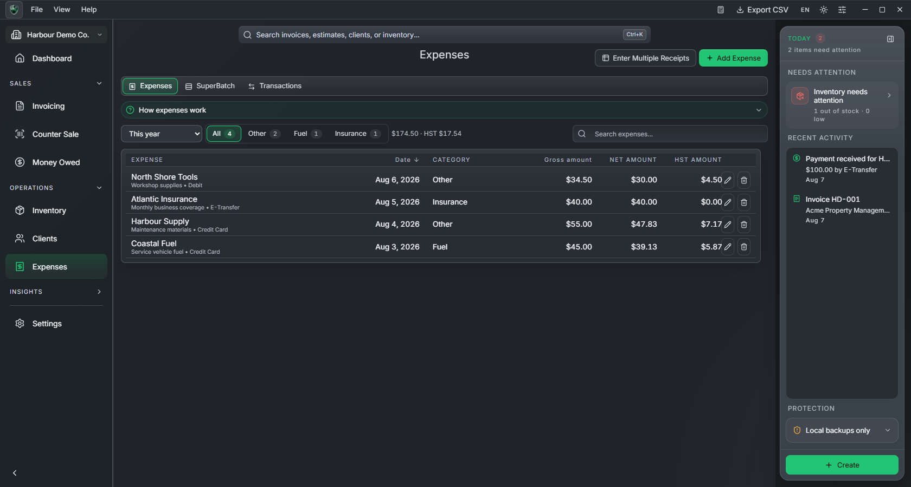
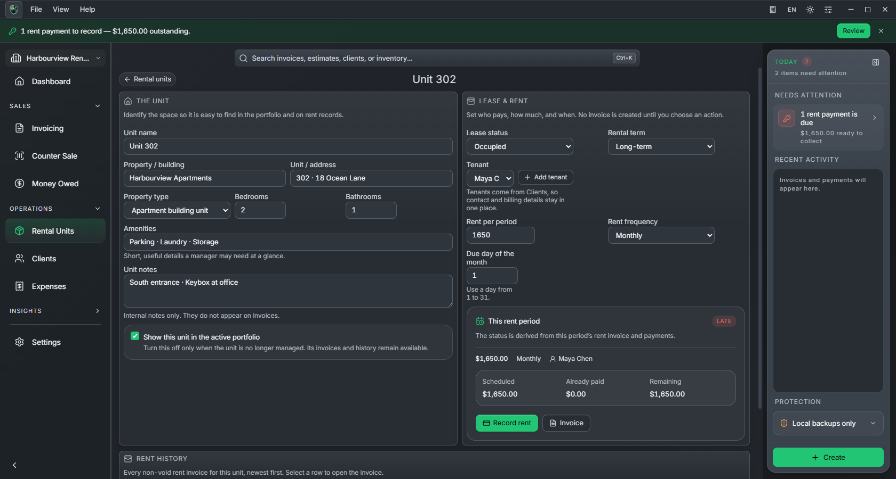

# NoCloud

### A practical Windows workspace for small businesses.

This is the official download page for NoCloud. The application keeps
day-to-day business records in one place and stores them on the Windows
computer where NoCloud is used.

### [Download NoCloud for Windows](https://github.com/GLevek89/NoCloud-Releases/releases/latest)

Windows 10 or Windows 11 · 64-bit · A NoCloud license key is required

*NoCloud shown with fictional demonstration data.*

## New in NoCloud 1.8.1

NoCloud 1.8.1 makes everyday work more comfortable and protects finished work
from accidental changes.

- **Better on smaller laptops:** forms and reports keep their working room,
  while Today opens only when it is needed.
- **Easier daily tools:** the View menu accurately shows whether Today and
  Quick Calculator are open, and the calculator is ready for typing right away.
- **Predictable pop-up windows:** overlapping windows close one at a time and
  return you to where you started.
- **Safer completed invoices:** paid and void invoices stay protected. Duplicate
  one when an editable copy is needed.
- **Clearer forms and help:** invoice, estimate, and kit forms give better
  keyboard feedback, and the welcome tour now matches the current menus.

Updating from 1.8.0 keeps your activation, business profiles, and records.
Calculations, file locations, and connected-device setup continue to work as
before.

## What NoCloud does

NoCloud keeps related work together. A client can move from estimate to invoice
and payment without entering the same details again. Expenses, inventory,
amounts owed, and reports remain available from the main menu.

- **Sales and clients:** client records, estimates, invoices, counter sales,
  payments, statements, and customizable invoice PDFs.
- **Profit estimates:** a monthly estimate on Dashboard and Reports, plus an
  internal estimated gross profit on each invoice when costs are entered.
  These figures are not shown on customer PDFs.
- **Expenses and HST:** single expense entry, multi-receipt entry, gross/net/HST
  amounts, vendor memory, and a combined transaction list.
- **Money owed:** outstanding and overdue invoices, aging, balances, printable
  summaries, and client statements.
- **Inventory and services:** products, materials, services, quantities, stock
  movements, low-stock notices, kits, receiving, and spreadsheet imports.
- **Reports and exports:** revenue, receivables, expenses, HST, rental income,
  invoice PDFs, CSV files, and accountant-ready Excel packages.
- **Different business setups:** separate workspaces for General Business,
  Excavation and Parts Sales, and Rental Locations. The interface is available
  in English and French.

## Search and filters

Search and filters are available throughout the main workspaces. Inventory can
be narrowed by stock condition, category, type, and business-specific group.
Invoices and estimates can be filtered by status, and rental units by occupancy.
Filtered lists can be exported where an export option is shown.

## SuperBatch (Beta)

SuperBatch is for importing a large table of expenses or deposits:

- Paste a table from Excel or select an XLSX, CSV, or TSV file.
- Review the columns NoCloud recognizes and correct the mapping when needed.
- Keep every source row visible, including malformed, ambiguous, ignored, and
  excluded rows.
- Resolve repeated category and account values once.
- Review possible duplicates before anything is saved.
- Compare row counts and gross, net, and HST totals with the source.
- Save the import as one batch and undo the complete batch afterward if needed.

SuperBatch is marked **Beta** in NoCloud. Its reconciliation totals should be
checked before committing a live import.

## More screens

These screens also use fictional demonstration data.

| Invoicing | Expenses |
| --- | --- |
|  |  |

### Rental locations

Rental workspaces keep unit details, tenants, lease information, rent status,
payments, and unit history together.

## Data and backups

Business records are stored on the Windows computer where NoCloud is used.
Normal daily work is local and does not depend on a browser session or permanent
internet connection.

- NoCloud supports automatic and manual backups.
- Backups can be verified before they are needed.
- A backup is checked before restore, and a safety copy is made first.
- Each business profile keeps its own clients, invoices, expenses, and other
  records separate.
- The backup folder can be placed on another drive or in a synchronized folder
  chosen by the user.

Business records are not uploaded to this repository.

## Installation

1. Open the [latest NoCloud release](https://github.com/GLevek89/NoCloud-Releases/releases/latest).
2. Download the Windows file whose name starts with `NoCloud-Setup-` and ends
   with `.exe`, then run it.
3. Open NoCloud, enter the supplied license key, and complete the guided setup.

> **Windows SmartScreen:** NoCloud's installer is not code-signed yet. Windows
> may display “Windows protected your PC.” Confirm that the installer came from
> this repository, then choose **More info → Run anyway**.

## Updates

NoCloud checks for updates while the application is running. When an update is
ready, the user chooses when to restart and install it. Normal updates keep the
existing activation, business profiles, and records in place. Update checks can
be turned off from **Settings → About**.

### [Download NoCloud for Windows](https://github.com/GLevek89/NoCloud-Releases/releases/latest)

[License](LICENSE)

